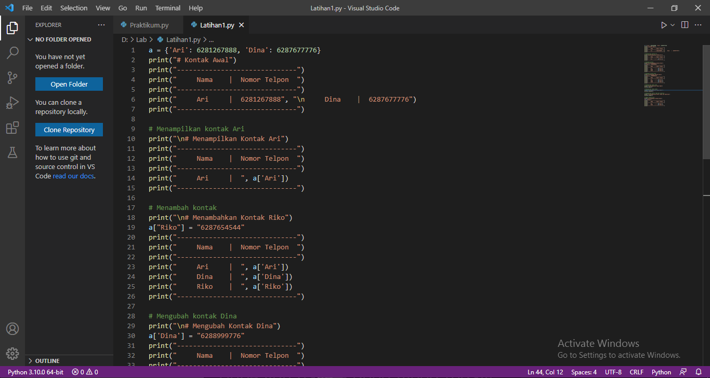
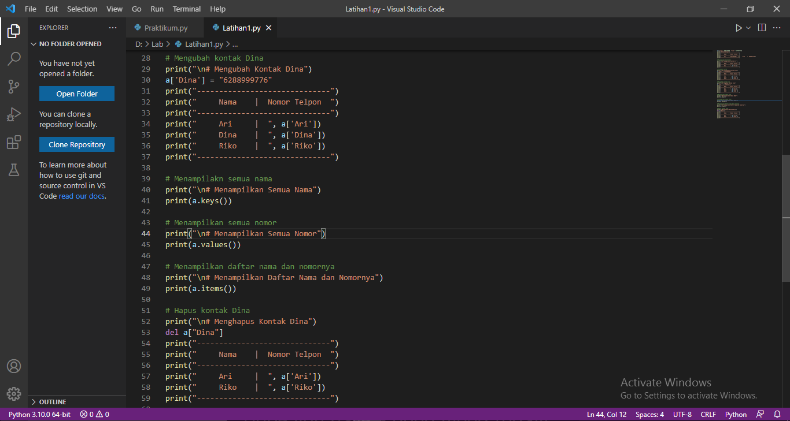
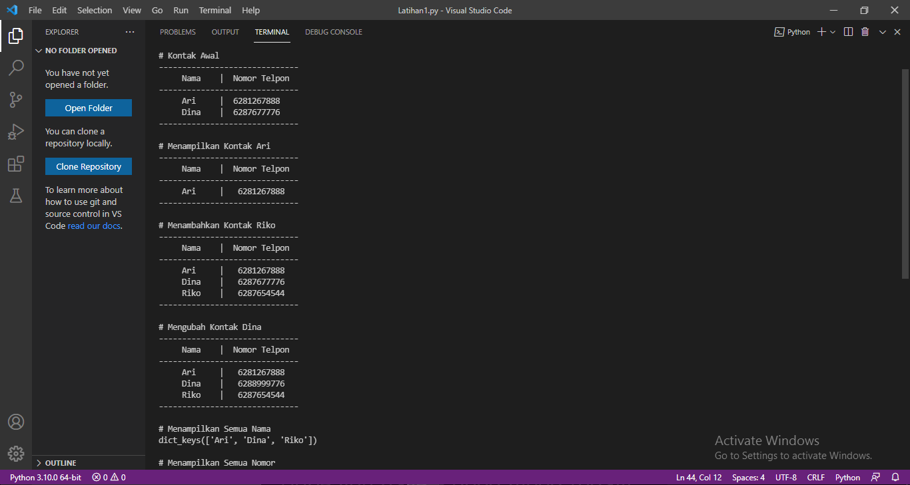
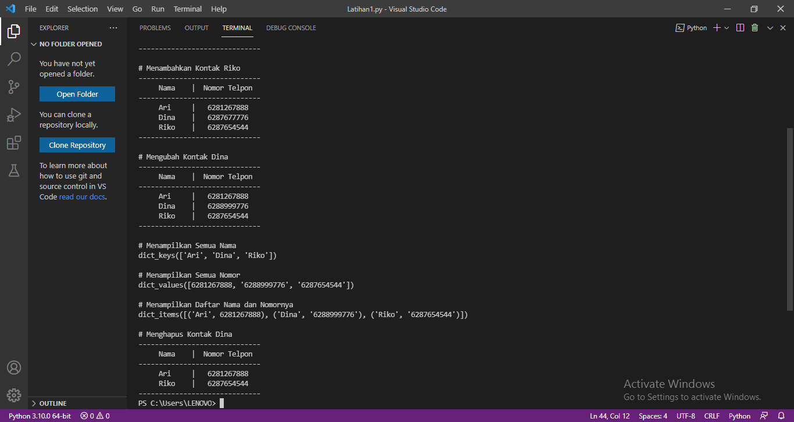
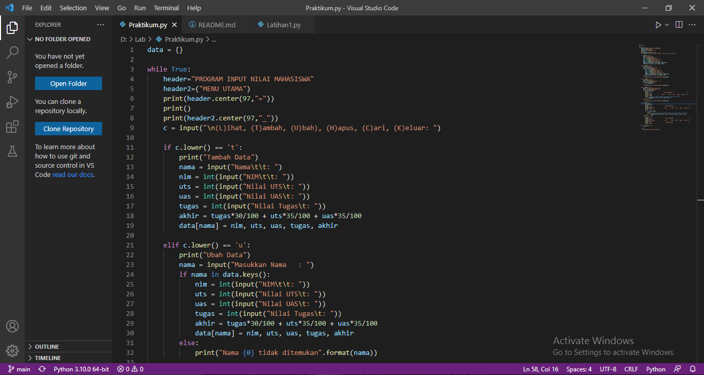
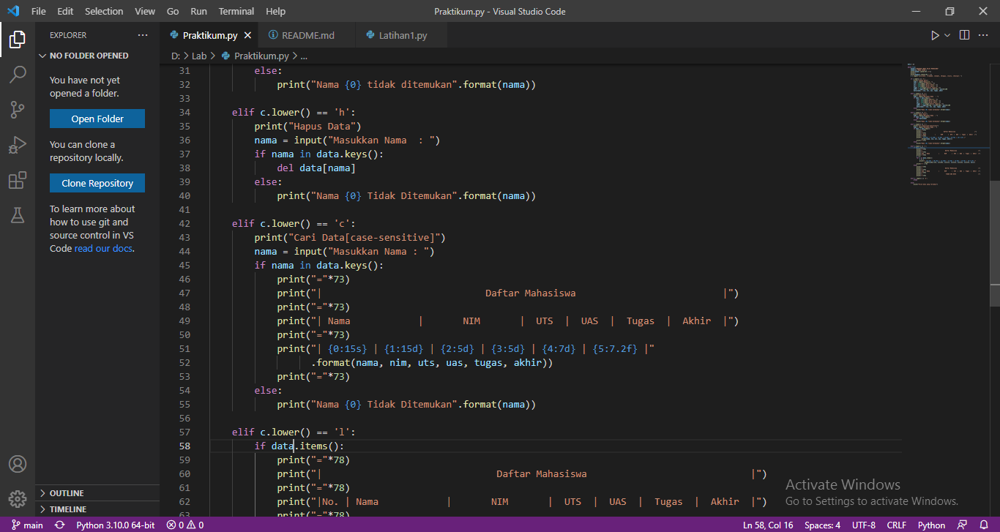
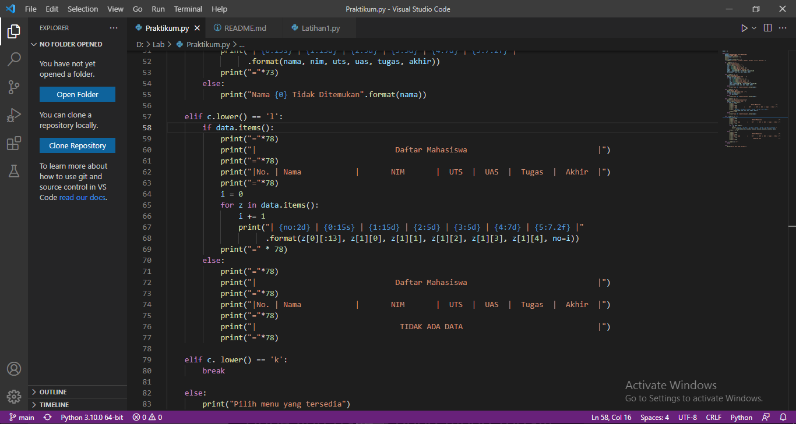
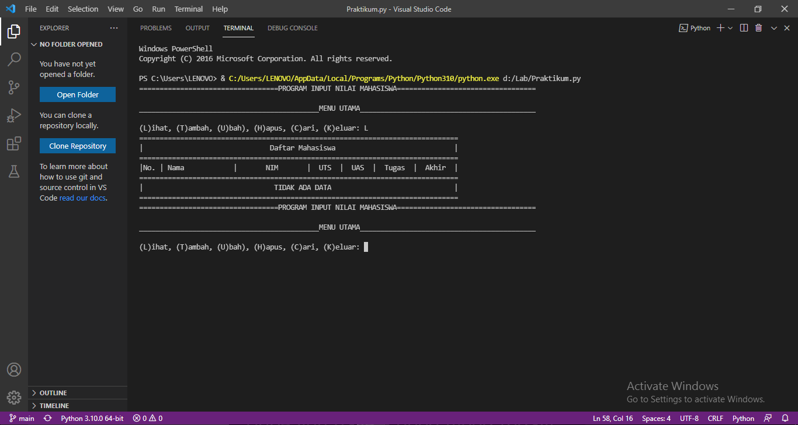
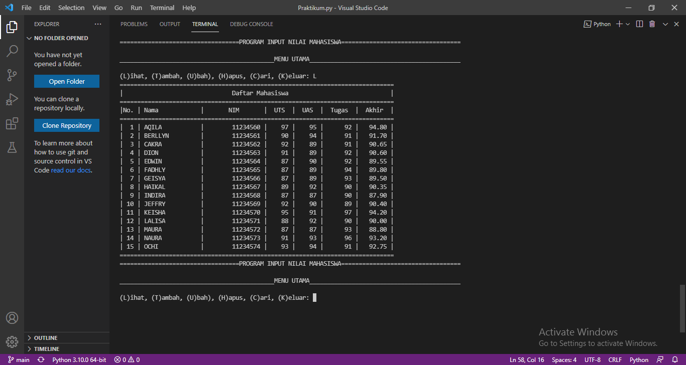
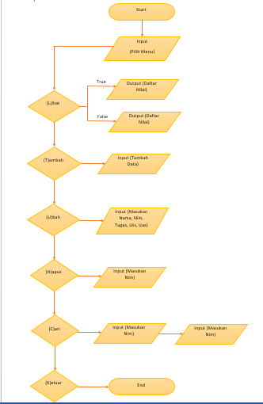

# Labspy05

### Profil
_Nama   : Nabilah Ananda Putri_
_Nim    : 312110263_
_Kelas  : TI.21.A.1

## Latihan 1

### Program
- 

- 

### Penjelasan
- Kontak Awal
```py
a = {'Ari': 6281267888, 'Dina': 6287677776}
```

- Untuk menampilkan kontak Ari dapat menggunakan 
```py
a['Ari']
```

- Kemudian untuk menambahkan kontak Riko dengan nomor 628765454 dapat menggunakan
```py
a["Riko"] = "6287654544"'
```

- Sedangkan untuk mengubah kontak dapat menggunakan 
```py
a['Dina'] = "6288999776"
```

- Untuk menampilkan semua nama dapat menggunakan 
```py
print(a.keys())
```

- Sedangkan untuk menampilkan nomor dapat menggunakan 
```py
print(a.values())
```

- Kemudian untuk menampilkan nama dan nomor dapat menggunakan 
```py
print(a.items())
```


- Untuk menghapus kontak Dina dapat menggunakan 
```py
del a["Dina"]
```

### Output
- 

- 

## Tugas Praktikum
> Buat program sederhana yang akan menampilkan daftar nilai mahasiswa, dengan ketentuan
> - Program dibuat dengan menggunakan *Dictionary*
> - Tampilkan menu pilihan : (Tambah Data, Ubah Data, Hapus Data, Tampilkan Data, Cari Data)
> - Nilai akhir diambil dari perhitungan 3 komponen nilai (tugas 30%, uts 35%, uas 35%)
> - Buatlah flowchart dan penjelasan programnya pada README.md
> - Commit dan push repository ke github

### Program
- 

- 

- 

### Penjelasan
- Buatlah dictionary yang akan diinput dengan data
```py
data = {}
```

- Membuat perulangan dan keterangan untuk pilihan menu
```py
while True:
    c = input("\n(L)ihat, (T)ambah, (U)bah), (H)apus, (C)ari, (K)eluar: ")
```

- Menambahkan data yang akan diinput kemudian masuk ke dalam dictionary
```py
if c.lower() == 't':
        print("Tambah Data")
        nama = input("Nama\t\t: ")
        nim = int(input("NIM\t\t: "))
        uts = int(input("Nilai UTS\t: "))
        uas = int(input("Nilai UAS\t: "))
        tugas = int(input("Nilai Tugas\t: "))
        akhir = tugas*30/100 + uts*35/100 + uas*35/100
        data[nama] = nim, uts, uas, tugas, akhir
```

- Jika ingin menampilkan data dapat menggunakan
```py
elif c.lower() == 'l':
        if data.items():
            print("="*78)
            print("|                               Daftar Mahasiswa                             |")
            print("="*78)
            print("|No. | Nama            |       NIM       |  UTS  |  UAS  |  Tugas  |  Akhir  |")
            print("="*78)
            i = 0
            for z in data.items():
                i += 1
                print("| {no:2d} | {0:15s} | {1:15d} | {2:5d} | {3:5d} | {4:7d} | {5:7.2f} |"
                      .format(z[0][:13], z[1][0], z[1][1], z[1][2], z[1][3], z[1][4], no=i))
            print("=" * 78)
        else:
            print("="*78)
            print("|                               Daftar Mahasiswa                             |")
            print("="*78)
            print("|No. | Nama            |       NIM       |  UTS  |  UAS  |  Tugas  |  Akhir  |")
            print("="*78)
            print("|                                TIDAK ADA DATA                              |")
            print("="*78)
```

- Mengubah data dapat menggunakan 
```py
elif c.lower() == 'u':
        print("Ubah Data")
        nama = input("Masukkan Nama   : ")
        if nama in data.keys():
            nim = int(input("NIM\t\t: "))
            uts = int(input("Nilai UTS\t: "))
            uas = int(input("Nilai UAS\t: "))
            tugas = int(input("Nilai Tugas\t: "))
            akhir = tugas*30/100 + uts*35/100 + uas*35/100
            data[nama] = nim, uts, uas, tugas, akhir
        else:
            print("Nama {0} tidak ditemukan".format(nama))
```

- Menghapus data dapat menggunakan
```py
elif c.lower() == 'h':
        print("Hapus Data")
        nama = input("Masukkan Nama  : ")
        if nama in data.keys():
            del data[nama]
        else:
            print("Nama {0} Tidak Ditemukan".format(nama))
```

- Mencari data dapat menggunakan
```py
 elif c.lower() == 'c':
        print("Cari Data[case-sensitive]")
        nama = input("Masukkan Nama : ")
        if nama in data.keys():
            print("="*73)
            print("|                             Daftar Mahasiswa                          |")
            print("="*73)
            print("| Nama            |       NIM       |  UTS  |  UAS  |  Tugas  |  Akhir  |")
            print("="*73)
            print("| {0:15s} | {1:15d} | {2:5d} | {3:5d} | {4:7d} | {5:7.2f} |"
                  .format(nama, nim, uts, uas, tugas, akhir))
            print("="*73)
        else:
            print("Nama {0} Tidak Ditemukan".format(nama))
```

- Jika sudah selesai input pilih menu 'K' untuk memberhentikan program
```py
elif c. lower() == 'k':
        break
```

### Output
- 

- 

### Flowchart
- 